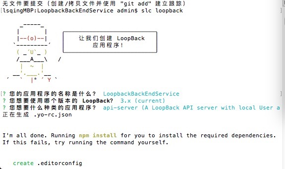

# 记录搭建的步骤

#### 创建loopback项目，创建并在项目中使用mongodb数据库

1. 进入项目文件夹:

     `cd projectPath`

2. 初始化项目：

     `slc loopback`

     

3. 创建一个mongodb数据库[Quick Start](http://mongodb.github.io/node-mongodb-native/2.2/quick-start/quick-start/)：

    - 按照mongodb官方docs，先创建一个文件夹来存放数据库。

    - 在项目根目录下创建创建名为db的文件夹，然后`cd db`

    - 执行

    `npm init`

    初始化数据库；

    接下来需要输入数据库的名字，版本等信息，不知道是什么的暂时留空。

    完成后确认即可。名字需要记下来，之后会用到。

    - 执行

    `npm install mongodb --save`

    安装资源，会看到下了一堆东西，很快就完成了。

    - 执行

    `mongod --dbpath=/data`

    让数据库跑起来，看到 waiting for connections on port 27017 就说明已经跑起来了。

4. 将刚才创建的数据量配置到项目中：

    - 进入项目根目录

    `cd projectPath`

    - 配置数据库

    `slc loopback:datasource`

    需要输入数据源名称等属性，database名称必须与之前数据库名称一致。

    最后会提示是否安装loopback-connector-mongodb@^1.4？安装。

    安装完成后就搞定了。

    - 验证数据库是否加入成功

    `slc arc`

    一个可视化界面，功能十分强大，目前还不太懂。

    会打开一个网页，可能会需要注册一个loopback账号才能用。

    注册登录后，选择composer 可以查看loopback模型和数据库。

    在数据库界面有个TestConnect 按钮可以测试数据库是否配置完成。

    如果success就算完成了。

##### 至此，项目搭建基本完成。已经可以在根目录下使用  `node .`  命令直接启动服务器来测试项目了。
