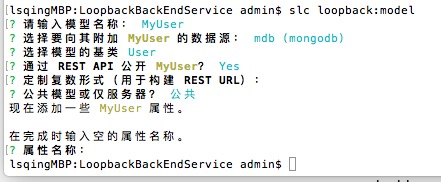
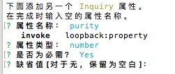
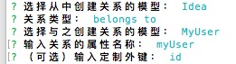
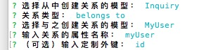
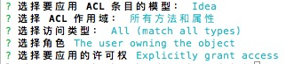

# 为项目添加model并确定model之间的关系,增加权限管理
#### 创建MyUser model(好像可以也叫User,然后继承自自带的User,好神奇.)

  `slc loopback:model`

  

*  属性先使用继承来的,创建自己的User只是为了方便以后维护.

* 同样的再创建Idea和Inquiry两个model,并添加简单的属性.
    添加属性会有提示,按照提示选择或者输入即可.

    

#### 定义model之间的关系

  `slc loopback:relation`







#### 定义权限管理,需要用户登录才能操作

`slc loopback:acl`



## 定义外键的话 需要在model的js文件中添加方法.

```
Idea.beforeRemote('create', function(context, user, next) {
     context.args.data.userId =context.req.accessToken.userId;
     //context.args.data.test="test";
     next();
   });
```
